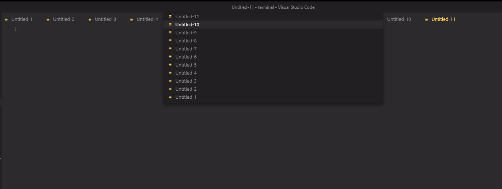
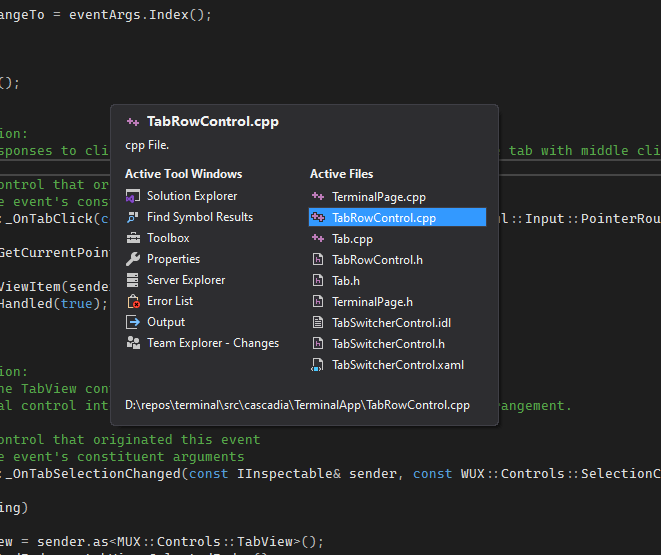
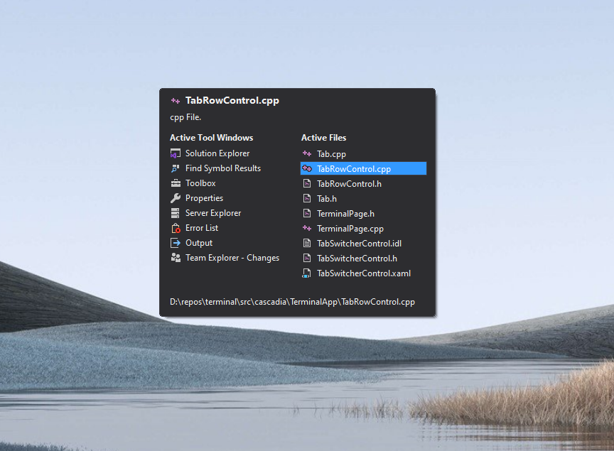
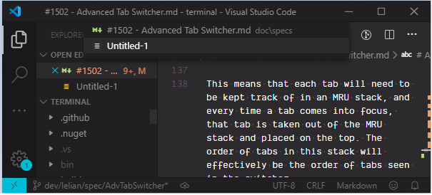

# Advanced Tab Switcher

## Abstract

Currently, the user is able to cycle through tabs on the tab bar. However, this horizontal cycling can be pretty inconvenient when the tab titles are long, or when there are too many tabs on the tab bar. In addition, a common use case is to switch between two tabs, e.g. when one tab is used as reference and the other is the actively worked-on tab. If the tabs are not right next to each other on the tab bar, it could be difficult to quickly swap between the two. To try to alleviate some of those pain points, we want to create an advanced tab switcher.

This spec will cover the design of the switcher, and how a user would interact with the switcher. It would be primarily keyboard driven, and would give a pop-up display of a vertical list of tabs. The tab switcher would also be able to display the tabs in Most Recently Used (MRU) order.

## Inspiration

This was mainly inspired by the tab switcher that's found in Visual Studio Code and Visual Studio.

VS Code's tab switcher appears directly underneath the tab bar, while Visual Studio's tab switcher presents itself as a box in the middle of the editor.




Both switchers behave very similarly, from the keychord that's pressed to show the switcher, to the way the switcher is dismissed and navigated.

## Solution Design

In addition to the current `vector<shared_ptr<Tab>> _tabs`, there will be another vector added, called `vector<weak_ptr<Tab>> _mruTabs` to represent the tabs in Most Recently Used order. `_mruTabs` will use `weak_ptr` because the tab switcher doesn't actually own the tabs, the `_tabs` vector does.

We'll create a new class `TabSwitcherControl` inside of TerminalPage, which will be initialized with a `vector<>&`. This is because it'll take in either `_tabs` or `_mruTabs` depending on what order the user would like the tabs to be displayed. Whenever the user changes the setting that controls the tab order, it'll update to get a reference to the correct vector.

This vector of tabs will be used to create a ListView, so that the UI would diplay a vertical list of tabs. Each element in the ListView would be associated with a Tab. This ListView would be hidden until the user presses a keybinding to show the ListView.

The `TabSwitcherControl` will be able to call any tab's `SetFocused` function to bring the tab into focus.
The `TabView`'s `SelectionChanged` handler listens for all events when a new terminal control comes into focus, so `TerminalPage::_OnTabSelectionChanged` will subsequently be called. This is where we'll update the MRU vector. By making the modification here, we can be sure that changing tabs from the TabSwitcher, clicking on a tab, or nextTab/prevTab-ing into a tab will update the MRU.

Adding or closing any tabs will also need to update both `_tabs` and `_mruTabs`.

### Most Recently Used

In addition to the existing vector of tabs in TerminalPage, there will be an additional vector of tabs to represent them in Most Recently Used order. In addition, any handlers for tabs such as closing a tab, opening a tab, and changing tab focus will need additional logic to modify the MRU tab vector.

## UI/UX Design

First, we'll give a quick overview of how the tab switcher UI would look like, then we'll dive into more detail on how the user would interact with the switcher.

The tab switcher will appear as a box in the center of the terminal with a fixed width and height. In the box will be a vertical list of tabs with their titles and their assigned number for quick switching, and only one line will be highlighted to signify that tab is currently selected. There will only be 9 numbered tabs for quick switching, and the rest of the tabs will simply have an empty space where a number would be.

The list would look something like this:
```
1 cmd (highlighted)
2 cmd
3 Windows PowerShell
4 MSYS:/c/Users/booboo
5 Git Bash
6 cmd
7 /c/
8 /d/
9 /e/
  /f/
  /g/
  /h/
```

The highlighted line can move up or down, and if the user moves up while the highlighted line is already at the top of the list, it will wrap around to the bottom of the list. Similarly, it will wrap to the top if the highlight is at the bottom of the list and the user moves down.

If there's more tabs than the UI can display, the list of tabs will scroll up/down as the user keeps iterating up/down. However, the number column does not move. The first nine tabs in the list will always be numbered.

Starting from the state in the mock above, imagine the user iterates down past the end of the visible list. The below mock shows the result.

```
1 Git Bash
2 cmd
3 /c/
4 /d
5 /e/
6 /f/
7 /g/
8 /h/
9 /i/
  /j/
  /k/
  /l/ (highlighted)
```

`Git Bash` is now associated with number 1, and the `cmd`, `cmd`, `Windows Powershell`, and `MSYS:/c/Users/booboo` tabs are no longer visible.

### Using the Switcher

#### Opening the Tab Switcher

The user will press a keybinding named `OpenTabSwitcher` to bring up the UI. For example, <kbd>ctrl+tab</kbd> is a  popular keychord for opening tab switchers. The user will be able to change it to whatever they like. There will also be an optional `anchor` arg that may be provided to this keybinding.

- `OpenTabSwitcher`
    - _default_ = <kbd>ctrl+tab</kbd>
    - _available args_: `anchor` - If this arg is given, the UI will dismiss on the release of the first key of this keybinding.

#### Keeping it open

We use the term `anchor` to illustrate the idea that the UI stays visible as long as something is "anchoring" it down.

So, when the `OpenTabSwitcher` keybinding is given the `anchor` arg, the _first_ key of the keybinding will act as the `anchor` key. Holding that`anchor` key down will keep the switcher visible, and once the `anchor` key is released, the switcher will dismiss.

If `OpenTabSwitcher` is not given the `anchor` arg, the switcher will stay visible even after the release of the key/keychord.

#### Switching through Tabs

The user will be able to navigate through the switcher with a couple of keybindings:

- Navigating down the list
    - <kbd>tab</kbd> or <kbd>downArrow</kbd>
- Navigating up the list
    - <kbd>shift+tab</kbd> or <kbd>upArrow</kbd>

The selected tab will be highlighted.

As the user is cycling through the tab list, the terminal won't actually switch to the selected tab. It will keep displaying the current open tab until the switcher is dismissed with an `anchor` key release or with <kbd>esc</kbd>.

While the user will be able to click on a tab in the switcher to bring the tab into focus, hovering over a tab with the mouse will not cause the tab highlight to go to that tab.

#### Closing the Switcher

1. If the `Anchor` arg is provided, the UI will be dismissed when the `anchor` key is released. It can also be dismissed when a `dismissal` key is pressed.
2. If the `Anchor` arg is not provided, the UI will only be dismissed when a `dismissal` key is pressed.

The following applies when `Anchor` is or is not provided.

1. The user can press a number associated with a tab to instantly switch to the tab and dismiss the switcher.
2. The user can click on a tab to instantly switch to the tab and dismiss the switcher.
3. The user can click outside of the UI to dismiss the switcher without bringing the selected tab into focus.

The two `dismissal` keys are <kbd>esc</kbd> and <kbd>enter</kbd>. When <kbd>esc</kbd> is pressed, the UI will dismiss without switching to the selected tab, effectively cancelling the tab switch. When <kbd>enter</kbd> is pressed, the UI will dismiss, and terminal will switch to the selected tab.

Pressing the `OpenTabSwitcher` keychord will not close the Switcher.

### Most Recently Used Order

We'll provide a setting that will allow the list of tabs to be presented in either _in-order_ (basically how the tabs are ordered on the tab bar), or _Most Recently Used Order_ (MRU). MRU means that the tab that the terminal most recently visited will be on the top of the list, and the tab that the terminal has not visited for the longest time will be on the bottom.

This means that each tab will need to be kept track of in an MRU stack, and every time a tab comes into focus, that tab is taken out of the MRU stack and placed on the top. The order of tabs in this stack will effectively be the order of tabs seen in the switcher.

How does a tab notify that it has come into focus recently? Since there's multiple ways of bringing a tab into focus (clicking on it, nextTab/prevTab into it, <kbd>ctrl+shift+1/2/3</kbd> into it), all of these need to let the MRU stack to know to update.

### Numbered Tabs

Similar to how the user can currently switch to a particular tab with a combination of keys such as <kbd>ctrl+shift+1</kbd>, we want to have the tab switcher provide a number to the first nine tabs (1-9) in the list for quick switching. If there are more than nine tabs in the list, then the rest of the tabs will not have a number assigned.

Once the tab switcher is open, and the user presses a number, the tab switcher will be dismissed and the terminal will bring that tab into focus.

## Capabilities

### Accessibility

TODO:

### Security

This shouldn't introduce any security issues.

### Reliability

We'll need to be wary about how the UI is presented depending on different sizes of the terminal. Since we want the switcher to be in the center of the terminal with a fixed width and height, how would it look when the terminal is really thin length/width-wise?

Visual Studio's tab switcher is a fixed size, and is always in the middle. Even when the VS window is smaller than the tab switcher size, the tab switcher will show up larger than the VS window itself.




Visual Studio Code's tab switcher has a minimum width. However, since VS Code's window has a minimum width and height, the tab switcher is always smaller than the window size.



Also, the MRU ordering should be accurate, and should always be updated on every tab focus.

Reordering tabs on the tab bar shouldn't change the MRU order.

### Compatibility

The existing way of navigating horizontally through the tabs on the tab bar should not break.
The implementation should also take into account the addition of other features on top of this UI, such as Pane Navigation described below.

### Performance, Power, and Efficiency

Since each tab focus change, tab addition, and tab close will need to update the MRU, we just need to be sure that updating the MRU isn't too slow.

## Potential Issues

## Future considerations

### Pane Navigation

Being able to navigate through your list of 1000 tabs is great, but what if I had 10 panes per tab? Having the tab switcher also be able to dive into the tab and figure out how to give the focus to a specific pane in a tab would be awesome.

To give an initial idea, the user would navigate to a tab, and press `leftArrow` or `rightArrow` (or some other keybindings) to go into/out of a pop out list of the tab's panes.

### Tab Search by Name/Title

This is something that would be nice to have, especially when there's a large list of tabs you're cycling through.

### Tab Preview on Hover

Should we do this? How would this be done? How does this affect MRU?

## Resources

Feature Request: An advanced tab switcher [#1502]  
Ctrl+Tab toggle between last two windows like Alt+Tab [#973]  
The Command Palette Thread [#2046]

<!-- Footnotes -->
[#973]: https://github.com/microsoft/terminal/issues/973
[#1502]: https://github.com/microsoft/terminal/issues/1502
[#2046]: https://github.com/microsoft/terminal/issues/2046
